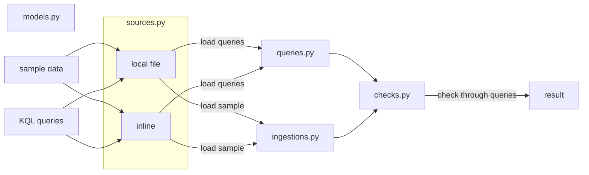

# Kusto-Doctor

A package for validating KQL queries using Kustainer.

This project is inspired by timtim589's project [here](https://github.com/timtim589/KustainerValidation).

# Warning

**Early Development Stage**: This project is in its early development stage. Significant changes to the API, functionality, and project structure may occur without prior notice. Use at your own risk and expect potential breaking changes in future releases.

**Security Notice**: Due to the lack of existing libraries that support secure cluster management without management KQL commands, this library implements some functions using string concatenation to compose KQL queries, which could potentially lead to **KQL injection risks**. This tool is intended **exclusively for test environments** and should **never be used in production environments**. Always validate and sanitize any user inputs when using this library, and ensure proper access controls are in place in your test environment.

This project will explore alternative implementations that do not rely on string concatenation to compose KQL queries, aiming to provide safer methods for cluster management and query execution in future versions.

# Design

The dataflow:

# Todo

- [x] Create ingestions.py for ingesting data.
- [x] Create sources.py for default data sources.
- [x] Create utils.py for initialization and pretty print.
- [x] Create queries.py for loading queries.
- [x] Create checks.py that uses queries.py for batch checking.
- [ ] Create decorators for table preparation like resetting data.

